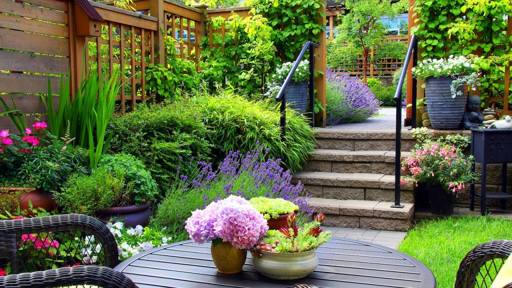

# 🌸 Flora - Flower Shop UI Template

A beautiful, responsive flower shop UI template built with pure HTML, CSS, and vanilla JavaScript. Perfect for showcasing floral services, events, and product galleries.

**Live Demo:** [https://flora-com.pages.dev/](https://flora-com.pages.dev/)



---

## 📖 Overview

Flora is a modern, lightweight flower shop website template designed for florists, flower delivery services, or anyone looking to showcase floral products and services. This is a **UI template only** - it includes no backend, database, authentication, or payment processing. All interactions are frontend demonstrations with "Coming Soon" modals for template features.

**Key Highlights:**
- 🎨 Clean, professional botanical design with green theme
- 📱 Fully responsive across all devices
- ⚡ Lightweight - no frameworks or dependencies
- 🚀 Deployed on Cloudflare Pages
- 🎭 Interactive modals and smooth animations
- ♿ Accessible with semantic HTML and ARIA labels

---

## ✨ Features

### Pages
- **Homepage** - Hero video section, service cards, pricing plans, contact form
- **Events** - Showcase upcoming floral events and special offers
- **Gallery** - Responsive image grid with hover effects
- **Shop** - Placeholder page with "Coming Soon" message

### Functionality
- ✅ Responsive navigation with mobile hamburger menu
- ✅ Professional modal system for "Coming Soon" features
- ✅ Contact form with client-side validation
- ✅ Smooth scroll behavior and animations
- ✅ Form submissions log to browser console (demo mode)
- ✅ Keyboard accessible (ESC to close modals)

### Optimization
- ✅ SEO-ready with meta tags (Open Graph, Twitter Cards)
- ✅ Cloudflare Pages optimized with `_headers` and `_redirects`
- ✅ Smart caching (1 year for assets, 1 hour for HTML)
- ✅ Security headers configured
- ✅ Favicon support

---

## 🛠️ Tech Stack

- **HTML5** - Semantic markup
- **CSS3** - Custom properties, Flexbox, Grid
- **Vanilla JavaScript** - No frameworks or libraries
- **Cloudflare Pages** - Hosting and deployment

**No build tools required** - This is a pure static site that runs directly in the browser.

---

## 📂 Project Structure

```
flora-website/
├── index.html              # Homepage with hero video
├── flowerevents.html       # Events page
├── flowergallery.html      # Gallery page
├── flowershop.html         # Shop page (coming soon placeholder)
├── flowerstyle.css         # Main stylesheet (784 lines)
├── flora.js                # JavaScript functionality (modal, menu, forms)
├── _headers                # Cloudflare Pages headers configuration
├── _redirects              # Cloudflare Pages redirects configuration
├── .gitignore              # Git ignore rules
├── LICENSE                 # MIT License
├── README.md               # This file
├── DEPLOYMENT.md           # Detailed deployment guide
├── assets/                 # Static assets directory
├── logo_transparent.png    # Site logo
├── cover.jpg               # Homepage hero image
├── cover1.jpg              # Events page cover
├── cover2.jpg              # Gallery page cover
├── videg.mp4               # Homepage hero video
├── f1.jpg - f5.jpg         # Gallery images
└── icon_01.png - icon_04.png  # Service icons
```

### Key Files Explained

- **`_headers`** - Configures security headers and cache control for Cloudflare Pages
- **`_redirects`** - Handles URL redirects and 404 fallback
- **`flora.js`** - Contains hamburger menu, modal system, and form handling
- **`flowerstyle.css`** - All styles with CSS custom properties for easy theming

---

## 🚀 Setup & Run Locally

### Prerequisites
- A modern web browser (Chrome, Firefox, Safari, Edge)
- Optional: Local web server (Python, Node.js, or PHP)

### Quick Start

1. **Clone the repository**
   ```bash
   git clone https://github.com/yooniqx/Flora.com.git
   cd Flora.com
   ```

2. **Open in browser**
   
   **Option A: Direct file access**
   - Simply open `index.html` in your browser
   - Note: Some features may require a local server

   **Option B: Using Python (Recommended)**
   ```bash
   python -m http.server 8000
   ```
   Then visit: `http://localhost:8000`

   **Option C: Using Node.js**
   ```bash
   npx http-server
   ```

   **Option D: Using PHP**
   ```bash
   php -S localhost:8000
   ```

3. **Explore the site**
   - Homepage: `http://localhost:8000/`
   - Events: `http://localhost:8000/flowerevents.html`
   - Gallery: `http://localhost:8000/flowergallery.html`
   - Shop: `http://localhost:8000/flowershop.html`

---

## 🌐 Deployment to Cloudflare Pages

### Method 1: GitHub Integration (Recommended)

**Step 1: Push to GitHub**
```bash
git add .
git commit -m "Initial commit"
git branch -M main
git remote add origin https://github.com/yourusername/flora-website.git
git push -u origin main
```

**Step 2: Connect to Cloudflare Pages**

1. Go to [Cloudflare Dashboard](https://dash.cloudflare.com/)
2. Navigate to **Pages** → **Create a project**
3. Click **Connect to Git**
4. Select your repository

**Step 3: Configure Build Settings**

| Field | Value |
|-------|-------|
| **Production branch** | `main` |
| **Framework preset** | `None` |
| **Build command** | *(leave empty)* |
| **Build output directory** | `/` |
| **Root directory** | `/` |
| **Environment variables** | *(none needed)* |

**Step 4: Deploy**
- Click **Save and Deploy**
- Wait 1-2 minutes for deployment
- Your site will be live!

For detailed deployment instructions, see [DEPLOYMENT.md](DEPLOYMENT.md)

---

## 🎨 Customization

### Colors

Edit CSS variables in `flowerstyle.css`:

```css
:root {
  --green: rgb(2, 161, 2);           /* Primary green */
  --dark-green: darkgreen;            /* Hover states */
  --dark-bg: rgb(29, 27, 27);        /* Footer background */
  --card-hover: rgb(236, 236, 236);  /* Card hover effect */
  --text-dark: rgb(52, 61, 51);      /* Dark text */
  --text-muted: rgb(65, 64, 64);     /* Muted text */
}
```

### Content

- **Text content:** Edit HTML files directly
- **Images:** Replace image files (keep same filenames or update HTML)
- **Logo:** Replace `logo_transparent.png` (recommended: transparent PNG)
- **Video:** Replace `videg.mp4` or remove video section from `index.html`

### Contact Information

Update footer contact details in all HTML files:
```html
<p>
  🔗 www.yoursite.com<br>
  ✉️ info@yoursite.com<br>
  📞 +1 234 567 8900<br>
  🏠 Your Address Here
</p>
```

---

## 📝 Template Notes

**This is a UI template for demonstration purposes:**

- ❌ No real backend or database
- ❌ No payment processing
- ❌ No user authentication
- ❌ No email sending (form logs to console)
- ✅ All data is dummy/placeholder
- ✅ "Buy" and "Submit" buttons show demo modals
- ✅ Perfect for portfolio and design showcase

**To make it production-ready, you would need to add:**
- Backend API for form submissions
- Database for products and orders
- Payment gateway integration
- User authentication system
- Email service for notifications

---

## 🧪 Testing

### Browser Compatibility
- ✅ Chrome/Edge (latest)
- ✅ Firefox (latest)
- ✅ Safari (latest)
- ✅ Mobile browsers (iOS Safari, Chrome Mobile)

### Responsive Breakpoints
- Desktop: 1200px+
- Tablet: 768px - 1199px
- Mobile: < 768px

---

## 📄 License

This project is licensed under the MIT License - see the [LICENSE](LICENSE) file for details.

---

## 🤝 Contributing

Contributions are welcome! Feel free to:
- Report bugs via GitHub Issues
- Suggest new features
- Submit pull requests
- Improve documentation

---

## 🔗 Links

- **Live Demo:** [https://flora-com.pages.dev/](https://flora-com.pages.dev/)
- **Repository:** [https://github.com/yooniqx/Flora.com](https://github.com/yooniqx/Flora.com)
- **Documentation:** [DEPLOYMENT.md](DEPLOYMENT.md)

---

**⭐ If you find this template useful, please consider giving it a star on GitHub!**

Made with 💚 for the web development community
